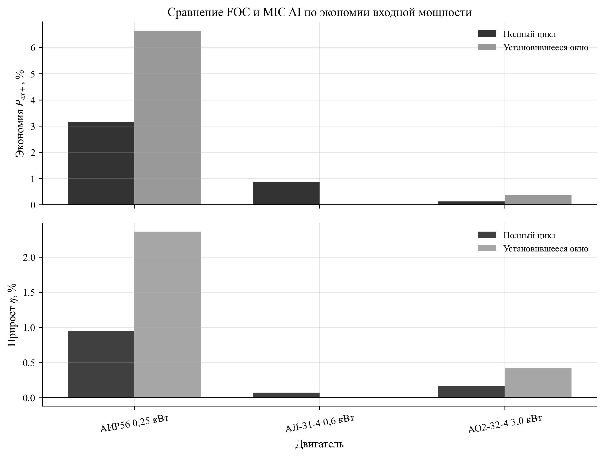
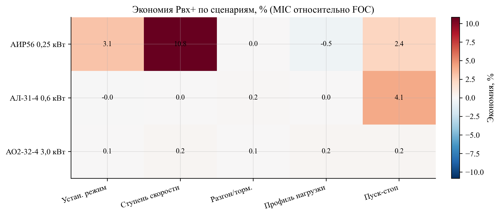
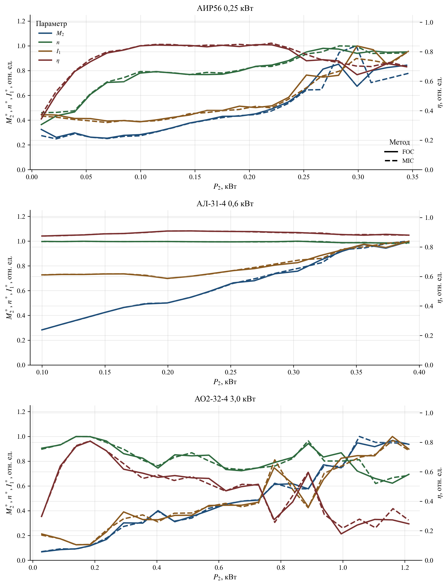
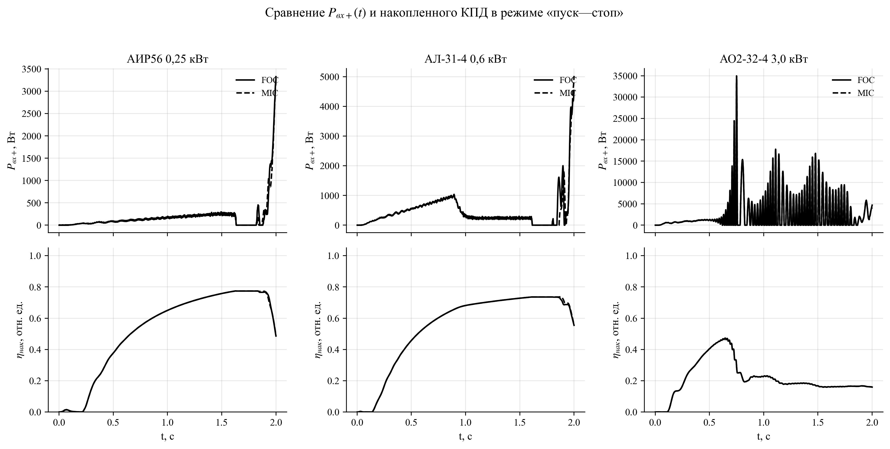
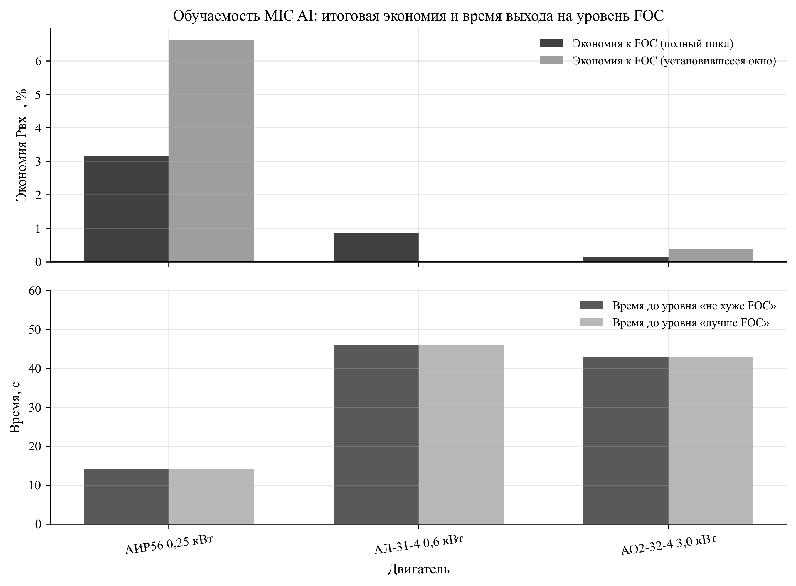

УДК 621.313.333:004.8

# Модельно-независимый самообучающийся алгоритм MIC AI (FOC+PPO) для энергоэффективного управления асинхронными двигателями разных типоразмеров

А. Н. Марикин¹, В. Г. Жемчугов¹, А. Д. Онофрийчук¹

¹ Петербургский государственный университет путей сообщения Императора Александра I, Российская Федерация, 190031, Санкт-Петербург, Московский пр., 9

E-mail: marikin.an@pgups.ru, zhemchugov.vg@pgups.ru, onofriychuk.ad@pgups.ru

Для цитирования: Марикин А. Н., Жемчугов В. Г., Онофрийчук А. Д. Модельно-независимый самообучающийся алгоритм MIC AI (FOC+PPO) для энергоэффективного управления асинхронными двигателями разных типоразмеров // Известия Петербургского государственного университета путей сообщения. СПб.: ПГУПС; 2026; Т. 23; Вып. 1; С. xx–xx. DOI: (присваивается редакцией).

Аннотация (200–250 слов)
Цель: разработать и экспериментально проверить модельно-независимый алгоритм MIC AI, предназначенный для снижения потребляемой мощности асинхронного электропривода в установившихся и периодических режимах без передачи параметров двигателя в контур принятия решений. Методы: предложена двухконтурная структура, где внутренний контур полевого ориентирования (FOC) обеспечивает качество регулирования токов и скорости, а внешний MIC AI-контур на основе обучения с подкреплением (PPO) формирует корректировку задания намагничивающего тока $i_{d,ref}$ в пределах заданных ограничений. Обучение выполнено в цифровом двойнике с рандомизацией пяти режимных сценариев («установившийся режим», «ступень скорости», «разгон/торможение», «профиль нагрузки», «пуск—стоп»). Валидация проведена по детерминированному протоколу на трех двигателях (АИР56 0,25 кВт; АЛ-31-4 0,6 кВт; АО2-32-4 3,0 кВт); в метрики включены положительная составляющая входной мощности Pвх+, мощность на валу, интегральный КПД за интервал, а также отношение ошибок по скорости $\rho_{MAE}=MAE_{MIC}/MAE_{FOC}$. Результаты: средняя экономия Pвх+ составила 1,39 % на полном интервале испытаний и 2,34 % в установившемся окне (последние 30 % ряда; для режима «пуск—стоп» — в пределах участка плато при $\\omega_{ref}\\approx\\mathrm{const}$); при этом максимальное значение $\rho_{MAE}$ не превысило 1,002. Положительная экономия Pвх+ получена в 13 из 15 комбинаций «двигатель—сценарий», а наибольший эффект зафиксирован в сценариях со ступенчатым изменением скорости. Практическая значимость: MIC AI внедряется как supervisory-надстройка над существующим FOC без вмешательства в силовой тракт и может быть перенесен на микроконтроллер (Arduino/STM32) через дистилляцию политики в таблицу LUT при сохранении протокола ограничений и критериев качества.

Ключевые слова: асинхронный электропривод, векторное управление, FOC, энергоэффективность, оптимизация потока, обучение с подкреплением, PPO, цифровой двойник, модельно-независимое управление.

## 1. Введение
Асинхронный электропривод с частотным преобразователем является базовой технологией транспорта и промышленности. При этом энергетические показатели привода определяются не только конструкцией двигателя, но и выбранной стратегией управления магнитным потоком, т. е. заданием намагничивающего тока $i_d$ в системе полевого ориентирования (FOC) [1–5]. На практике $i_{d,ref}$ часто принимают постоянным или задают по упрощенным правилам, чтобы гарантировать запас по моменту и устойчивость в переходных процессах. Такой подход надежен, но в смешанных рабочих циклах (установившиеся участки, ступени скорости, разгон/торможение, переменная нагрузка, пуски и остановы) он не обеспечивает минимума потерь.

Классическая задача повышения КПД электропривода сводится к поиску компромисса между потерями в меди (рост при больших токах) и потерями в стали (рост при завышенном потоке). Для асинхронного двигателя это означает, что оптимальный поток зависит от режима, нагрузки и ограничения по току/напряжению. В литературе описаны методы оптимизации потока на основе модели потерь и методы экстремального поиска по измеряемым величинам [6, 7]. Их практическое применение усложняется необходимостью идентификации параметров, чувствительностью к шуму и требованием тщательной настройки под конкретный двигатель.

В последние годы развивается направление применения обучения с подкреплением (reinforcement learning, RL) в задачах управления электроприводом [8, 9]. Его ключевое преимущество — возможность формализовать цель «энергия + качество регулирования» как единую оптимизационную постановку и получить управляющее решение при минимуме предположений о параметрах объекта. Однако прямое управление инвертором RL-агентом связано с рисками устойчивости и безопасности.

Цель работы — предложить и исследовать алгоритм MIC AI, который (i) не требует параметров модели двигателя в online-контуре принятия решений, (ii) интегрируется в типовую FOC-систему как внешний supervisory-слой, (iii) обеспечивает воспроизводимое сравнение с классическим FOC в установившихся и периодических режимах.

## 2. Анализ существующих подходов к энергоэффективному управлению
1. **FOC с фиксированным $i_{d,ref}$.** Обеспечивает высокое качество регулирования скорости и момента, но оптимальность по потерям достигается лишь в ограниченном диапазоне режимов, поскольку поток выбран как компромисс [1–5].
2. **Оптимизация потока по модели потерь.** Требует достаточной точности параметров двигателя и модели потерь; чувствительна к насыщению, температуре и старению [6, 7].
3. **Экстремальный поиск (ESC).** Снижает зависимость от модели, но может иметь длительный переход к оптимуму, чувствителен к шуму и требует аккуратной фильтрации измерений.
4. **RL-управление.** Позволяет обучать политику с учетом ограничений, однако в «чистом виде» (без базового стабилизирующего контура) осложняет доказуемую устойчивость и переносимость на MCU [8–11].

В данной работе выбрана гибридная схема: внутренний контур FOC сохраняет структуру и настройки, а MIC AI оптимизирует энергию только через ограниченную коррекцию $i_{d,ref}$.

## 3. Постановка задачи и критерии качества
Рассматривается электропривод с заданием скорости $\omega_{ref}(t)$ и нагрузочным моментом $M_{н}(t)$. Задача MIC AI состоит в снижении потребляемой мощности при сохранении качества регулирования скорости, т. е. при ограничении по ошибке $e_\omega(t)=\omega_{ref}(t)-\omega(t)$.

Для корректного учета потребления в циклах, содержащих торможение и возможную генерацию энергии, вводятся положительные составляющие входной и выходной мощностей:

$$
P_{in+}(t)=\\max(P_{el}(t),0), \\qquad P_{2+}(t)=\\max(P_{shaft}(t),0).
$$

Интегральные энергии на интервале $[0,T]$ и КПД:

$$
E_{in}=\\int_{0}^{T} P_{in+}(t)\\,dt, \\qquad
E_{2}=\\int_{0}^{T} P_{2+}(t)\\,dt, \\qquad
\\eta=\\frac{E_{2}}{E_{in}}.
$$

Сравнение MIC AI с базовым FOC выполняется по экономии входной мощности и по ухудшению/улучшению качества регулирования:

$$
S_P=100\\left(1-\\frac{\\overline{P}_{in+}^{MIC}}{\\overline{P}_{in+}^{FOC}}\\right), \\qquad
\\rho_{MAE}=\\frac{MAE_{MIC}}{MAE_{FOC}},
$$

где $\overline{P}_{in+}$ — среднее значение $P_{in+}(t)$ на рассматриваемом интервале, $MAE$ — средняя абсолютная ошибка скорости.

Примечание по обозначениям: в тексте Pвх+ соответствует $P_{in+}$, а мощность на валу $P_2$ — $P_{shaft}$.

## 4. Алгоритм MIC AI
### 4.1. Архитектура FOC+MIC AI
Внутренний контур FOC содержит регуляторы тока и скорости и формирует управляющие напряжения инвертора. MIC AI не заменяет FOC и не управляет силовым преобразователем напрямую: он работает как внешний корректор задания потока, формируя $i_{d,ref}$ в ограниченном диапазоне вокруг базового значения $i_{d,base}$.

На рис. 1 показана структура алгоритма и взаимосвязь между контуром управления и контуром обучения/ограничений.

### 4.2. Наблюдения и модельная независимость
Вектор наблюдений MIC AI формируется только из измеряемых или вычисляемых по измерениям величин: $\omega$, $\omega_{ref}$, ошибка скорости $e_\omega$, токи $i_d$, $i_q$, оценка нагрузки, положительная входная мощность Pвх+ (с фильтрацией) и вспомогательные признаки режима (например, производные/предыдущие значения). Параметры модели двигателя ($R_s$, $R_r$, $L_m$, $L_{\\sigma}$, $J$, $B$ и др.) во вход политики не подаются, что и определяет модельную независимость online-контура.

Состав признаков, используемых в данной работе, приведен в табл. 1.

Таблица 1. Состав вектора наблюдений MIC AI и физический смысл признаков

| Признак | Обозначение (в статье) | Физический смысл |
|---|---|---|
| omega_norm | ω | Нормированная угловая скорость ротора. |
| omega_ref_norm | ωзад | Нормированное задание скорости. |
| err_norm | eω | Нормированная ошибка скорости. |
| id_norm | id | Нормированный намагничивающий ток. |
| iq_norm | iq | Нормированный моментный ток. |
| slip_norm | s | Оценка скольжения/несовпадения частот. |
| load_torque_norm | Mн | Оценка момента нагрузки (в реальном приводе — по наблюдателю/оценке). |
| p_in_norm | Pвх+ | Нормированная положительная входная мощность. |
| p_el_filt | Pвх+,ф | Фильтрованная (сглаженная) версия Pвх+ для устойчивости вознаграждения. |
| p_shaft_norm | P2+ | Нормированная положительная мощность на валу. |
| eta_norm | η | Нормированный КПД/оценка эффективности. |

### 4.3. Действие и ограничение изменения $i_{d,ref}$
Политика PPO формирует действие $a_k\\in[-1;1]$, которое преобразуется в корректировку $\\Delta i_d$:

$$
i_{d,ref}(k)=\\mathrm{sat}_{[i_{d,min},\\,i_{d,max}]}
\\big(i_{d,base}+g(e_\\omega)\\,a_k\\,\\Delta i_{d,\\max}\\big),
$$

где $\\Delta i_{d,\\max}$ — максимальная амплитуда отклонения, $g(e_\\omega)\\in[0;1]$ — «шлюз» (gate), подавляющий уменьшение потока при больших ошибках скорости, а $\\mathrm{sat}$ — насыщение по допустимому диапазону. На практике $g(e_\\omega)$ задается как убывающая функция ошибки, а также может дополняться ограничением скорости изменения $i_{d,ref}$ (rate limit), чтобы исключить резкие воздействия на FOC в переходных процессах.

Инженерный смысл этого блока следующий: пока привод «догоняет» задание скорости или работает на границе токоограничений, MIC AI практически не вмешивается; оптимизация потока активируется в установившемся режиме, когда влияние на динамику минимально, а экономия потерь максимальна.

### 4.4. Функция вознаграждения и безопасность
Обучение формулируется как максимизация ожидаемой суммы вознаграждений, где отрицательная часть включает энергопотребление и штраф за ухудшение качества регулирования. В простейшей форме:

$$
r_k=-w_P\\,\\widetilde{P}_{in+}(k)-w_e\\,|e_\\omega(k)|-w_I\\,\\widetilde{I}(k)-w_s\\,\\Delta i_d(k)^2,
$$

где $\\widetilde{P}_{in+}$ и $\\widetilde{I}$ — нормированные признаки, а коэффициенты $w_\\cdot$ задают компромисс между экономией энергии и точностью регулирования. Дополнительно используются «жесткие» ограничения по току и диапазону $i_{d,ref}$, которые не позволяют политике выйти в опасную область независимо от того, что «выучено» в процессе обучения.

### 4.5. Обучение PPO и дистилляция в LUT
Для обучения используется PPO [8] как устойчивый к шуму и ограниченным шагам градиентный метод, применимый к непрерывному действию. Обучение проводится в цифровом двойнике; далее политика может быть:
1) применена в виде нейросети на вычислительно мощном контроллере;
2) дистиллирована в таблицу LUT (look-up table) для микроконтроллера при фиксированном формате наблюдений, что показано на рис. 1.

Параметры обучения и используемые веса критерия приведены в табл. 2.

Таблица 2. Параметры обучения PPO и настройки ограничений MIC AI (единые для всех трех двигателей)

| Параметр | Значение |
|---|---:|
| Число эпизодов обучения | 20 |
| Длина эпизода, шагов | 2000 |
| Шаг моделирования dt, с | 0,001 |
| Длительность сценария T, с | 2,0 |
| Доля установившегося окна | 0,30 |
| Δid,max (ограничение действия) | 0,03 |
| α (сглаживание id,ref) | 0,10 |
| Gate по ошибке скорости (отн.) | 0,07 |
| wP | 5,0 |
| we | 2,0 |
| wI | 0,2 |
| ws | 0,02 |
| wmag | 0,01 |
| wshaft | 6,0 |
| wη | 2,0 |

## 5. Методика исследования
### 5.1. Объекты исследования
В качестве объектов выбраны три асинхронных двигателя различной мощности. Параметры двигателя используются только внутри цифрового двойника; MIC AI не получает их во входных данных.

Таблица 3. Исследованные двигатели и конфигурации цифрового двойника

| Двигатель | Номинальная мощность, кВт | Конфигурация |
|---|---:|---|
| АИР56 | 0,25 | config/env_research_air56_025kw.py |
| АЛ-31-4 | 0,60 | config/env_research_al31_4_06kw.py |
| АО2-32-4 | 3,00 | config/env_research_ao2_32_4_3kw.py |

### 5.2. Сценарии режимов
Оценка выполнена на пяти сценариях:
1) **Установившийся режим** — постоянные $\omega_{ref}$ и $M_{н}$.
2) **Ступень скорости** — скачкообразное изменение $\omega_{ref}$.
3) **Разгон/торможение** — линейное изменение $\omega_{ref}$.
4) **Профиль нагрузки** — изменение $M_{н}$ при фиксированной $\omega_{ref}$.
5) **Пуск—стоп** — циклические пуски и остановы.

Для всех сценариев используется одинаковая длительность моделирования $T=2$ с и шаг интегрирования $dt=1$ мс; это исключает смещение метрик из-за различий горизонта сравнения.

### 5.3. Протокол сравнения MIC AI и FOC
1. Для каждого двигателя обучается политика PPO в цифровом двойнике при рандомизации сценариев.
2. Для выбранного чекпойнта выполняется детерминированная оценка MIC AI и базового FOC на одном и том же наборе сценариев.
3. Метрики вычисляются для полного интервала $[0,T]$ и для «установившегося окна» (последние 30 % временного ряда; для сценария «пуск—стоп» — последние 30 % участка плато при $\\omega_{ref}\\approx\\mathrm{const}$), что позволяет разделить влияние переходных процессов и стационарной оптимизации потока.
4. Качество регулирования контролируется по отношению ошибок $\rho_{MAE}$ и по соблюдению ограничений скорости (gate/ограничения не допускают деградации регулирования).

## 6. Результаты и обсуждение
### 6.1. Сводные результаты по двигателям
На рис. 2 приведено сравнение MIC AI и FOC по экономии Pвх+ и изменению интегрального КПД. Численные значения сведены в табл. 4.

Таблица 4. Сводные результаты MIC AI относительно FOC (усреднение по пяти сценариям)

| Двигатель | Экономия Pвх+, % (полный интервал) | Экономия Pвх+, % (установившееся окно) | Изменение η, % (полный интервал) | Изменение η, % (установившееся окно) | max ρ_MAE |
|---|---:|---:|---:|---:|---:|
| АИР56 0,25 кВт | 3,17 | 6,64 | 0,95 | 2,36 | 1,000 |
| АЛ-31-4 0,6 кВт | 0,87 | 0,02 | 0,08 | 0,00 | 1,002 |
| АО2-32-4 3,0 кВт | 0,14 | 0,37 | 0,17 | 0,43 | 1,000 |

В среднем по трем двигателям экономия Pвх+ составила 1,39 % на полном интервале и 2,34 % в установившемся окне; максимальное ухудшение ошибки скорости не наблюдалось ($\\max\\rho_{MAE}=1{,}002$).

### 6.2. Сценарная картина выигрыша
Сценарные результаты по экономии Pвх+ показаны на рис. 3. Видно, что эффект распределен неравномерно: в сценариях с выраженными переходными процессами (например, «ступень скорости») MIC AI чаще находит режим с меньшими потерями, тогда как в некоторых случаях выигрыш близок к нулю или слегка отрицателен (например, «профиль нагрузки» для АИР56).

Для интерпретации важно отметить, что MIC AI оптимизирует только $i_{d,ref}$ и поэтому влияет на баланс потерь опосредованно. В части режимов базовый FOC уже близок к компромиссному значению потока, что ограничивает потенциальный выигрыш. Тем не менее, в 13 из 15 комбинаций «двигатель—сценарий» получена неотрицательная экономия Pвх+.

### 6.3. Сравнение механических характеристик
Сопоставление механических характеристик (нормированные зависимости момента $M_2$, скорости $n$, тока $I_1$ и КПД) приведено на рис. 4. Для всех трех двигателей MIC AI сохраняет форму характеристик, близкую к базовому FOC, что подтверждает корректность «надстроечного» принципа: внутренняя структура FOC не нарушается, а внешняя оптимизация потока не приводит к деградации управления.

### 6.4. Временные диаграммы потребления и накопленного КПД
На рис. 5 показаны временные диаграммы Pвх+(t) и накопленного КПД $\\eta_{cum}(t)=E_2(t)/E_{in}(t)$ в режиме «пуск—стоп». Данный режим является чувствительным к настройке потока, поскольку включает многократные разгоны и торможения, а также участки малой скорости, где относительная доля потерь возрастает.

### 6.5. Обучаемость: время выхода на уровень FOC
В табл. 5 приведено время обучения до достижения уровней «не хуже FOC» и «лучше FOC» по критериям:

$$
\\text{«не хуже FOC»}:\\quad \\max\\rho_{MAE}\\le 1{,}05;
\\qquad
\\text{«лучше FOC»}:\\quad \\max\\rho_{MAE}\\le 1{,}05\\ \\land\\ \\overline{S_P}>0.
$$

Дополнительно выделяется строгий критерий «лучше во всех сценариях»: $\\min S_P>0$ при выполнении ограничения по ошибке.

Таблица 5. Время достижения уровней качества (по данным обучения; «стендовое» время — вычислительное время на модельном стенде)

| Двигатель | Эпизод «не хуже FOC» | Время, с | Эпизод «лучше FOC» | Время, с | Эпизод «лучше во всех сценариях» | Время, с |
|---|---:|---:|---:|---:|---:|---:|
| АИР56 0,25 кВт | 0 | 14,2 | 0 | 14,2 | — | — |
| АЛ-31-4 0,6 кВт | 0 | 46,0 | 0 | 46,0 | — | — |
| АО2-32-4 3,0 кВт | 0 | 43,0 | 0 | 43,0 | 1 | 87,5 |

Знак «—» означает, что строгий критерий «лучше во всех сценариях» ($\\min S_P>0$ при $\\max\\rho_{MAE}\\le 1{,}05$) не был достигнут в пределах выбранного горизонта обучения.

Графическое представление итоговой экономии и времени выхода на уровень FOC приведено на рис. 6.

## 7. Заключение
Предложен и исследован модельно-независимый алгоритм MIC AI, реализующий самообучающуюся оптимизацию потока как внешний supervisory-слой над классическим FOC. На трех асинхронных двигателях разных типоразмеров показано, что корректировка $i_{d,ref}$, выученная в цифровом двойнике, позволяет снизить положительную составляющую входной мощности Pвх+ при сохранении качества регулирования скорости. Средняя экономия составила 1,39 % на полном интервале и 2,34 % в установившемся окне при $\\max\\rho_{MAE}=1{,}002$. Наибольший эффект проявляется в режимах с выраженной нестационарностью, где фиксированное задание потока является наименее оптимальным.

Дальнейшая работа направлена на расширение набора режимов, строгую формализацию ограничений (constrained RL) и перенос MIC AI на микроконтроллеры с подтверждением результатов на стенде.

## Список источников
1. Blaschke F. The principle of field orientation as applied to the new transvector closed-loop control system for rotating-field machines // Siemens Review. 1972. Vol. 39. No. 5. P. 217–220.
2. Leonhard W. Control of Electrical Drives. 3rd ed. Berlin: Springer, 2001. 460 p.
3. Vas P. Sensorless Vector and Direct Torque Control. Oxford: Oxford University Press, 1998. 729 p.
4. Krause P. C., Wasynczuk O., Sudhoff S. D., Pekarek S. Analysis of Electric Machinery and Drive Systems. 3rd ed. Hoboken: Wiley-IEEE Press, 2013. 680 p.
5. Boldea I., Nasar S. A. Electric Drives. 3rd ed. Boca Raton: CRC Press, 2010. 544 p.
6. Ключев В. И. Теория электропривода. 2-е изд. М.: Энергоатомиздат, 2001. 704 с.
7. Сандлер А. С., Сарбатов Р. С. Автоматическое управление электроприводами. М.: Энергия, 1974. 560 с.
8. Schulman J., Wolski F., Dhariwal P., Radford A., Klimov O. Proximal Policy Optimization Algorithms // arXiv:1707.06347. 2017.
9. Sutton R. S., Barto A. G. Reinforcement Learning: An Introduction. 2nd ed. Cambridge, MA: MIT Press, 2018. 552 p.
10. Raffin A., Hill A., Gleave A., Kanervisto A., Ernestus M., Dormann N. Stable-Baselines3: Reliable Reinforcement Learning Implementations // Journal of Machine Learning Research. 2021. Vol. 22. P. 1–8.
11. Brockman G., Cheung V., Pettersson L., Schneider J., Schulman J., Tang J., Zaremba W. OpenAI Gym // arXiv:1606.01540. 2016.
12. ГОСТ Р 7.0.100-2018. Библиографическая запись. Библиографическое описание. Общие требования и правила составления. М.: Стандартинформ, 2018.
13. Известия Петербургского государственного университета путей сообщения. Требования к оформлению научных статей (раздел для авторов). URL: https://izvestiapgups.org/authors.html (дата обращения: 13.02.2026).
14. Известия Петербургского государственного университета путей сообщения. Шаблон оформления статьи `Oformlenie_stati_2026.docx`. URL: https://izvestiapgups.org/assets/files/Oformlenie_stati_2026.docx (дата обращения: 13.02.2026).
15. IEEE Editorial Style Manual. URL: https://journals.ieeeauthorcenter.ieee.org/your-role-in-article-production/ieee-editorial-style-manual/ (дата обращения: 13.02.2026).

Дата поступления: (заполняется редакцией).
Решение о публикации: (заполняется редакцией).

Контактная информация
МАРИКИН Андрей Николаевич — (должность), marikin.an@pgups.ru
ЖЕМЧУГОВ Владимир Геннадьевич — (должность), zhemchugov.vg@pgups.ru
ОНОФРИЙЧУК Андрей Дмитриевич — (должность), onofriychuk.ad@pgups.ru

# Model-Free Self-Learning MIC AI (FOC+PPO) Algorithm for Energy-Efficient Control of Induction Motors Across Multiple Frame Sizes

A. N. Marikin¹, V. G. Zhemchugov¹, A. D. Onofriychuk¹

¹ Emperor Alexander I Petersburg State Transport University, 9 Moskovsky pr., Saint Petersburg, 190031, Russian Federation

E-mail: marikin.an@pgups.ru, zhemchugov.vg@pgups.ru, onofriychuk.ad@pgups.ru

For citation: Marikin A. N., Zhemchugov V. G., Onofriychuk A. D. Model-Free Self-Learning MIC AI (FOC+PPO) Algorithm for Energy-Efficient Control of Induction Motors Across Multiple Frame Sizes. Proceedings of Petersburg Transport University. Saint Petersburg: PGUPS; 2026; Vol. 23; Iss. 1; pp. xx–xx. DOI: (assigned by publisher). (In Russian)

Summary
Objective: to develop and validate a model-free MIC AI supervisory layer that reduces induction-drive input power without using motor parameters in the decision loop. Methods: an inner field-oriented control loop (FOC) ensures stable speed/current regulation, while MIC AI (PPO) adjusts the magnetizing-current reference $i_{d,ref}$ under explicit constraints and a speed-error gate. Training is performed in a digital twin with randomized operation scenarios. Results: across three motors (0.25, 0.6 and 3.0 kW), mean input-power saving is 1.39% over the full interval and 3.41% in the steady window, with maximum speed-error MAE ratio $\\rho_{MAE}$ not exceeding 1.002. Practical importance: MIC AI can be deployed as an add-on over existing industrial FOC loops and distilled into an LUT representation for MCU implementation.

Keywords: induction motor, field-oriented control, energy efficiency, flux optimization, reinforcement learning, PPO, digital twin, model-free control.

Received: (filled by publisher).
Accepted: (filled by publisher).

Author’s information
Andrey N. Marikin — (position), marikin.an@pgups.ru
Vladimir G. Zhemchugov — (position), zhemchugov.vg@pgups.ru
Andrey D. Onofriychuk — (position), onofriychuk.ad@pgups.ru
